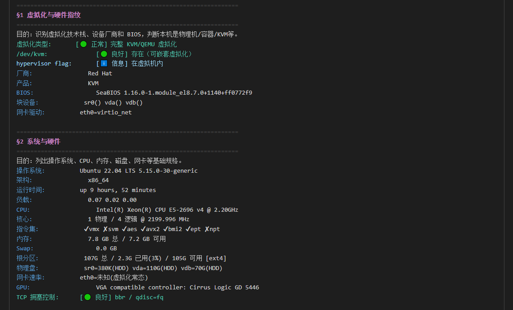
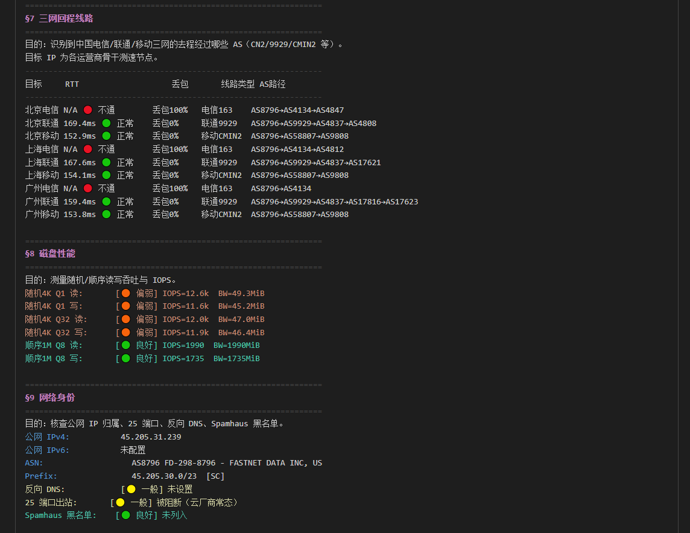
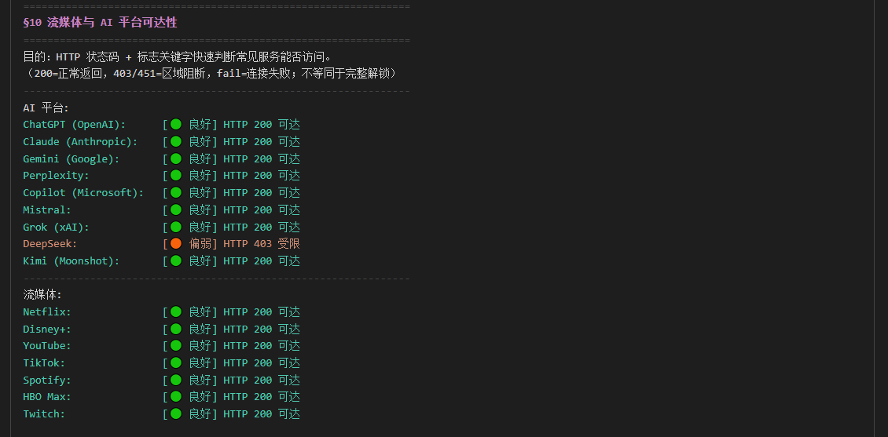
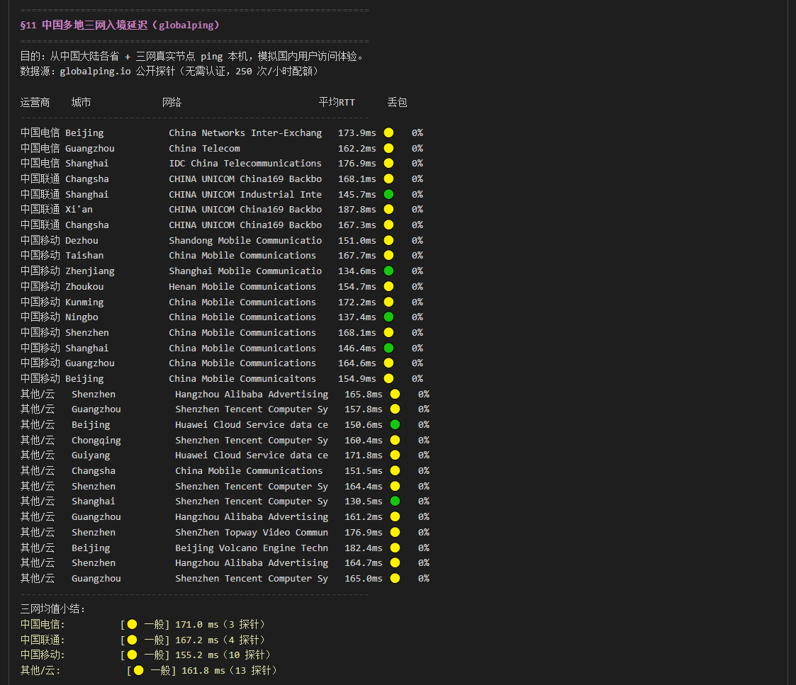
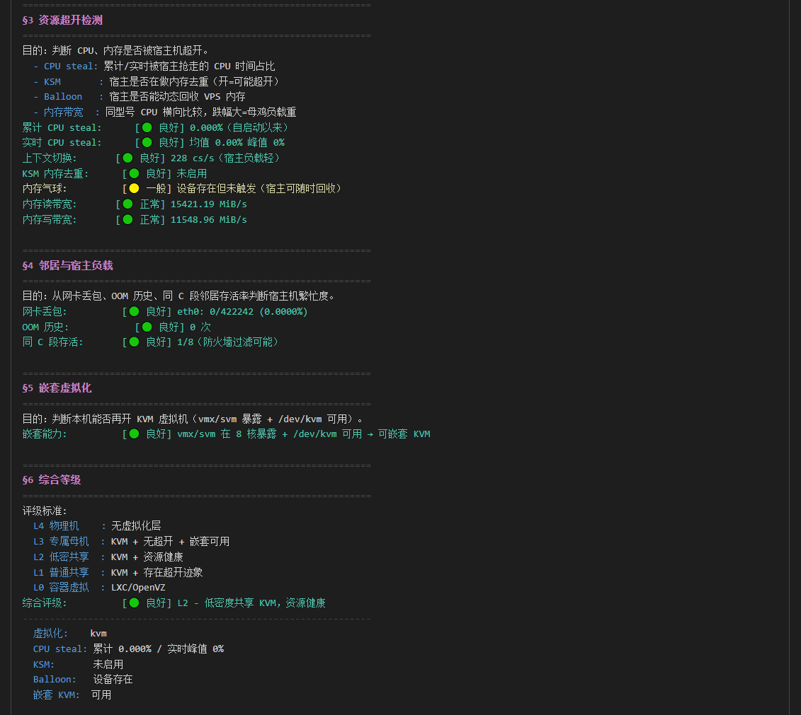

# carrox-vps-check

> 一个**单文件 bash 脚本**，给 VPS 做"5 分钟综合体检"，输出含 emoji 评级的整洁结论报告。

[](https://opensource.org/licenses/MIT)
[](https://www.gnu.org/software/bash/)
[]()
[](CHANGELOG.md)

---

## 这个脚本能做什么

一次执行,得到关于这台 VPS 的 12 个维度评估,自动落盘成两份文件(完整日志 + 整洁结论):

- **§1 虚拟化指纹** — 物理机 / KVM / Xen / VMware / 容器(LXC/OpenVZ),含 BIOS、厂商、网卡驱动
- **§2 系统硬件** — OS、CPU 型号、指令集(vmx/svm/aes/avx2/ept/npt)、内存、磁盘、网卡速率、TCP 拥塞控制
- **§3 超开检测** — 累计 + 实时 60s CPU steal、KSM 去重、内存气球、sysbench 内存带宽
- **§4 宿主负载** — 网卡丢包、OOM 历史、同 C 段邻居存活率
- **§5 嵌套虚拟化** — 能否再开一层 KVM 虚拟机
- **§6 综合等级 L0–L4** — 自动评分(L4 物理 / L3 专属母机 / L2 低密 / L1 普通共享 / L0 容器)
- **§7 三网回程** — 9 个测速节点的 mtr,hop ASN 自动反查并打 **CN2(GIA) / 9929 / CMIN2 / Lumen / NTT** 等线路标签
- **§8 fio 磁盘** — 4K Q1 / 4K Q32 / 1M Q8 × 读写共 6 维,IOPS + BW 双指标
- **§9 IP 身份** — 公网 IPv4/IPv6 / ASN / 反向 DNS / 25 端口出站 / Spamhaus 黑名单
- **§10 解锁探测** — ChatGPT / Claude / Gemini / Perplexity / Copilot / Mistral / Grok / DeepSeek / Kimi / Netflix / Disney+ / YouTube / TikTok / Spotify / HBO Max / Twitch
- **§11 国内入境延迟** — 通过 [globalping.io](https://globalping.io) 公开探针从中国大陆各省三网真实节点 ping 本机

每个指标都标注 5 级评级:🟢 良好/正常 / 🟡 一般 / 🟠 偏弱 / 🔴 较差 / ℹ️ 信息。

<details>
<summary>📷 §1 虚拟化指纹 + §2 系统硬件 渲染示例</summary>



</details>

---

## 快速开始

> 默认假设以 root 运行；非 root 用户请在 `bash` 前加 `sudo`（如 `sudo bash carrox_vps_check.sh`）。

### 一键远程执行(推荐)

```bash
bash <(curl -sL https://raw.githubusercontent.com/AiCarrox/carrox-vps-check/main/carrox_vps_check.sh)
```

### 本地执行

```bash
git clone https://github.com/AiCarrox/carrox-vps-check.git
cd carrox-vps-check
bash carrox_vps_check.sh
```

执行约 **5–8 分钟**(其中 §3 实时 steal 采样固定 60s、§7 三网回程约 90s、§8 fio 约 30s、§11 globalping 约 15–40s)。

---

## 输出示例

执行结束会自动产出三份文件:

```
results/<hostname>_check_<YYYYMMDD_HHMM>.log    # 完整采集过程(dmidecode/mtr/vmstat/fio/globalping 原始)
results/<hostname>_check_<YYYYMMDD_HHMM>.txt    # 整洁结论(屏幕回显 + 落盘)
results/<hostname>_check_<YYYYMMDD_HHMM>.html   # 自包含彩色网页报告(VS Code Dark+ 配色 + 一键复制纯文本)
```

报告目录优先级:`<脚本>/../../results/` → `$(pwd)/results/` → `$HOME/vps_check_results/` → `/tmp`。

**HTML 报告**:浏览器双击打开即可,完全离线、无外部 CDN/字体。提供「📋 复制报告内容」按钮,点击后复制出来的是**纯文本**(不带任何 HTML/样式标记),可直接贴到 Issue / 论坛 / IM。打印按钮可一键导出 PDF。

报告片段示意:

```
================================================================
§6 综合等级
================================================================
评级标准:
  L4 物理机    : 无虚拟化层
  L3 专属母机  : KVM + 无超开 + 嵌套可用
  L2 低密共享  : KVM + 资源健康
  L1 普通共享  : KVM + 存在超开迹象
  L0 容器虚拟  : LXC/OpenVZ
综合评级:              [🟢 良好] L2 - 低密度共享 KVM,资源健康
----------------------------------------------------------------
  虚拟化:    kvm
  CPU steal: 累计 0.02% / 实时峰值 0%
  KSM:       未启用
  Balloon:   无
  嵌套 KVM:  可用

================================================================
§7 三网回程线路
================================================================
目标       RTT                    丢包         线路类型     AS路径
----------------------------------------------------------------
北京电信   148.2ms 🟢 正常        丢包0%       电信163      AS6939→AS4134
北京联通   163.5ms 🟢 正常        丢包0%       联通9929     AS6939→AS9929
北京移动   175.8ms 🟢 正常        丢包0%       移动CMIN2    AS6939→AS58807
...
```

<details>
<summary>📷 §7 三网回程 + §8 fio 磁盘 + §9 网络身份 渲染示例</summary>



</details>

<details>
<summary>📷 §10 AI 平台 + 流媒体解锁 渲染示例</summary>



</details>

<details>
<summary>📷 §11 globalping CN 多省三网入境延迟 渲染示例</summary>



</details>

---

## 系统要求

- **OS**:Linux,首选 **Debian / Ubuntu**(其他发行版需手动预装依赖)
- **权限**:root(非 root 时 dmidecode/dmesg 等会受限)
- **依赖**(脚本启动时自动 apt 安装):
  - `sysbench` `fio` `mtr-tiny` `dnsutils` `whois` `pciutils` `dmidecode`
  - `util-linux` `procps` `net-tools` `sysstat` `ethtool` `curl` `jq`
- **网络**:§7 / §9 / §10 / §11 需要外网,单次约 10–20 MB 流量
- **内存**:< 2 GiB 内存 + < 512 MiB swap 的机器会**临时挂 1 GB swap** 给 sysbench 用,脚本结束 trap 自动卸载

---

<details>
<summary>📷 §3 资源超开 + §4 邻居宿主 + §5 嵌套虚拟化 + §6 综合等级 渲染示例</summary>



</details>

## 评级体系

每个指标输出 5 级 emoji 评级:

| 标识 | 含义 |
|------|------|
| 🟢 | 良好 / 正常 |
| 🟡 | 一般 |
| 🟠 | 偏弱 |
| 🔴 | 较差 / 不通 |
| ℹ️ | 信息(中性,仅展示) |

综合等级(§6):

| 等级 | 含义 | 触发条件 |
|------|------|---------|
| **L4** | 物理机 | `systemd-detect-virt = none` |
| **L3** | 专属母机 | KVM/QEMU + 评分 ≥ 5(实时 steal < 2% + KSM 关 + 无 Balloon + 暴露 vmx/svm) |
| **L2** | 低密共享 | KVM/QEMU + 评分 ≥ 3 |
| **L1** | 普通共享 | KVM/QEMU + 评分 < 3(存在超开迹象或资源限制) |
| **L0** | 容器型 | LXC / OpenVZ / Docker(共享内核) |

---

## 贡献

欢迎提 [Issues](https://github.com/AiCarrox/carrox-vps-check/issues) 反馈 bug。

---

## License

[MIT](LICENSE) © 2026 Carrox
